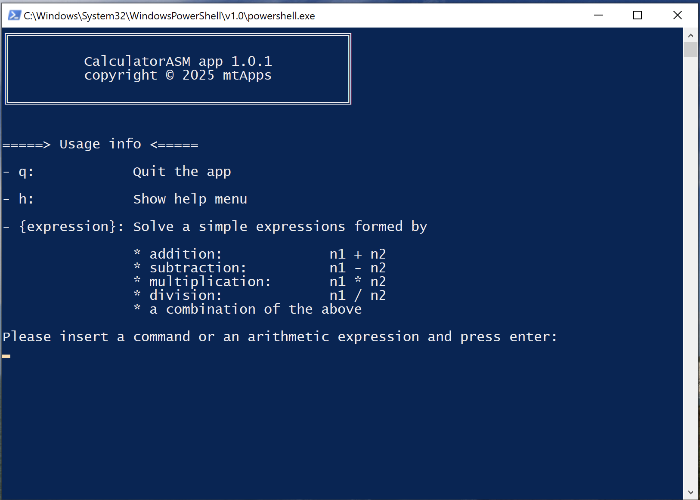

# Calculator ASM

A simple yet powerful calculator application written in x86-64 assembly for Windows, designed to demonstrate the fundamentals of 64-bit assembly programming.

## Table of Contents

1. [Project Overview](#project-overview)
2. [Features](#features)
3. [Screenshots](#screenshots)
4. [Environment Setup](#environment-setup)
   - [Prerequisites](#prerequisites)
   - [Clone the Repository](#clone-the-repository)
   - [Setup Steps](#setup-steps)
   - [Building the Application](#building-the-application)
5. [Usage](#usage)
   - [How to Run](#how-to-run)
6. [Development](#development)
   - [Windows x64 Assembly Guidelines](#windows-x64-assembly-guidelines)
   - [NASM Assembly Quick Guide](#nasm-assembly-quick-guide)
   - [Tools](#tools)
   - [Debugging](#debugging)
7. [Acknowledgments](#acknowledgments)
8. [Support](#support)
9. [License](#license)

## Project Overview

This project is a Windows x64 calculator application implemented entirely in assembly language using the NASM assembler. It serves as an educational tool to explore low-level programming concepts, system calls, and the x86-64 architecture. The application supports basic arithmetic operations and provides a simple command-line interface for user interaction.

The project was inspired by the Win64 HelloWorld example provided by [mcandre](https://gist.github.com/mcandre/b3664ffbeb4f5764b36a397fafb04f1c) and extends it to include more complex functionality.

## Features

- **Basic Arithmetic Operations**: Supports addition, subtraction, multiplication, and division.
- **Command-Line Interface**: Accepts user input for calculations and commands.
- **Help Menu**: Displays usage instructions and supported operations.
- **Unicode and UTF-8 Support**: Handles both Unicode and UTF-8 strings for input and output.
- **Educational Focus**: Demonstrates key concepts of x86-64 assembly programming, including register usage, system calls, and memory management.

## Screenshots

Here are some screenshots of Calculator ASM in action:



## Environment Setup

### Prerequisites

To build and run this project, you will need the following tools and environment:

1. **NASM Assembler**: [Download NASM](https://nasm.us/) to compile the assembly files.
2. **Visual Studio Build Tools**: [Download Visual Studio Build Tools](https://visualstudio.microsoft.com/it/downloads/?q=build+tools) to link the compiled object files into an executable.
3. **Windows Environment**: The application is designed for Windows x64 systems.

> **Tip**: You can install the required tools using [Chocolatey](https://chocolatey.org/install). Run the following command in an elevated PowerShell terminal:

```bash
choco install nasm visualstudio2022buildtools visualstudio2022-workload-vctools
```

### Clone the Repository

```bash
git clone https://github.com/mtmarco87/calculator-asm.git
cd calculator-asm
```

### Setup Steps

1. **Add NASM to PATH**: Ensure the NASM binary folder is added to your `PATH` environment variable. This step is necessary for the `makefile` to locate the assembler.

2. **Ensure Build Environment Setup**: The build process automatically detects and configures the required Visual Studio build environment (`vcvarsall.bat`) using the `vswhere.exe` tool. If Visual Studio is installed, no manual configuration is needed.

   If autodetection fails, ensure the following:

   - Visual Studio is installed with the "C++ Build Tools" workload.
   - The `vswhere.exe` utility is available in its default installation path:
     ```
     C:\Program Files (x86)\Microsoft Visual Studio\Installer\vswhere.exe
     ```
   - Alternatively, you can manually specify the `VS_VERSION` (e.g., `VS_VERSION=2017`, `VS_VERSION=2022`) or provide the full path to `vcvarsall.bat` using the `VCVARSALL_PATH` variable in the `make` command.

### Building the Application

The build process is automated using a `makefile` for simplicity. Run the following command to assemble and link the application:

```bash
make
```

#### Detailed Build Steps

**Note**: The steps below are provided for informational purposes only. You do not need to execute them manually if you are using the `make` command. The `makefile` automates these steps for you.

1. **Assemble the Object File**:
   ```bash
   nasm -f win64 calculator.asm -o out\calculator.obj -g
   ```
2. **Set Up the Build Environment**:

   ```bash
   # Step 1: Use vswhere.exe to locate vcvarsall.bat
   "C:\Program Files (x86)\Microsoft Visual Studio\Installer\vswhere.exe" -latest -products * -requires Microsoft.VisualStudio.Component.VC.Tools.x86.x64 -find **/vcvarsall.bat

   # Example Output (for Visual Studio 2022):
   # C:\Program Files\Microsoft Visual Studio\2022\Community\VC\Auxiliary\Build\vcvarsall.bat

   # Step 2: Call vcvarsall.bat with the amd64 argument to set up the environment
   call "C:\Program Files\Microsoft Visual Studio\2022\Community\VC\Auxiliary\Build\vcvarsall.bat" amd64
   ```

3. **Link the Executable**:
   ```bash
   link /entry:start /subsystem:console out\calculator.obj kernel32.lib
   ```

**Note**: If you encounter issues with the `makefile`, you can use the batch script `scripts/createapp.bat calculator.asm` as an alternative. Alternatively, you may execute the build steps manually as described above.

## Usage

### How to Run

1. Run the application:
   ```bash
   out\calculator.exe
   ```
2. Follow the on-screen instructions:
   - Enter `h` to display the help menu.
   - Enter `q` to quit the application.
   - Enter an arithmetic expression (e.g., `5 + 3`) to calculate the result.

## Development

### Windows x64 Assembly Guidelines

When working with assembly on Windows, keep the following in mind:

- **Reserved Registers**: Microsoft reserves the following registers for its own use:
  - **RBX**, **RBP**, **RSI**, **RDI**, **R12-R15**.
  - If you use these registers, save their values on the stack and restore them before returning.
- **Win64 Function Call Convention**: The first four parameters of a function are passed in the following registers:
  - **RCX**, **RDX**, **R8**, **R9**.
  - Additional parameters are passed on the stack.
- **Stack Requirements (Win64 home space)**: Before making a function call, reserve 32 bytes of stack space plus 16 bytes for alignment. Ensure this space is zeroed out for proper function execution.

**Note**: For more details on the Windows-specific behavior described above, you can refer to the [University of Alaska Fairbanks x86/x64 Reference](https://www.cs.uaf.edu/2017/fall/cs301/reference/x86_64.html).

### NASM Assembly Quick Guide

#### General Purpose Registers (GP Registers)

- **64-bit (QWORD)**: `rax`, `rbx`, `rcx`, `rdx`, `rbp`, `rsp`, `rsi`, `rdi`, `r8-r15`.
- **32-bit (DWORD)**: `eax`, `ebx`, `ecx`, `edx`, `ebp`, `esp`, `esi`, `edi`, `r8d-r15d`.
- **16-bit (WORD)**: `ax`, `bx`, `cx`, `dx`, `bp`, `sp`, `si`, `di`, `r8w-r15w`.
- **8-bit (BYTE)**:
  - Low: `al`, `bl`, `cl`, `dl`, `r8b-r15b`.
  - High: `ah`, `bh`, `ch`, `dh`.

#### SSE/AVX Registers

- **SSE (128-bit)**: `xmm0-xmm15`.
- **AVX (256-bit)**: `ymm0-ymm15`.
- **AVX-512 (512-bit)**: `zmm0-zmm15`.

#### NASM Data Operand Sizes

- **1 byte (8-bit)**: `byte`, `DB`, `RESB`.
- **2 bytes (16-bit)**: `word`, `DW`, `RESW`.
- **4 bytes (32-bit)**: `dword`, `DD`, `RESD`.
- **8 bytes (64-bit)**: `qword`, `DQ`, `RESQ`.
- **10 bytes (80-bit)**: `tword`, `DT`, `REST`.
- **16 bytes (128-bit)**: `oword`, `DO`, `RESO`.
- **32 bytes (256-bit)**: `yword`, `DY`, `RESY`.
- **64 bytes (512-bit)**: `zword`, `DZ`, `RESZ`.

### Tools

- **Windows Calculator**: The default Windows Calculator has a "Programmer Mode" that can be extremely useful for assembly programming. Use it to perform quick binary, hexadecimal, and decimal calculations.

### Debugging

- **[x64dbg](https://x64dbg.com/)**: A powerful debugger for Windows x86/x64 applications. It is highly recommended for debugging and reverse engineering assembly code.

## Acknowledgments

Special thanks to the following resources and individuals for their guidance and inspiration:

- [NASM](https://nasm.us/)
- [Felix Cloutier's x86/x64 Reference](https://www.felixcloutier.com/x86/)
- [SenecaCDOT x86/x64 Quick Start](https://wiki.cdot.senecacollege.ca/wiki/X86_64_Register_and_Instruction_Quick_Start)
- [University of Alaska Fairbanks x86/x64 Reference](https://www.cs.uaf.edu/2017/fall/cs301/reference/x86_64.html)
- [giobe2000](http://www.giobe2000.it/)
- [mcandre](https://gist.github.com/mcandre)
- [Hermann Krohn](https://towardsdatascience.com/hello-world-not-so-easy-in-assembly-23da6644ff0d)
- [below](https://github.com/below)

## Support

If you find this project useful, consider supporting its development:

- ⭐ Star the repository to show your appreciation.
- 💬 Share feedback or suggestions by opening an issue.
- ☕ [Buy me a coffee](https://buymeacoffee.com/mtmarco87) to support future updates and improvements.
- 🔵 BTC Address: `bc1qzy6e99pkeq00rsx8jptx93jv56s9ak2lz32e2d`
- 🟣 ETH Address: `0x38cf74ED056fF994342941372F8ffC5C45E6cF21`

## License

This project is licensed under the [GNU General Public License v3.0](LICENSE). See the `LICENSE` file for details.
